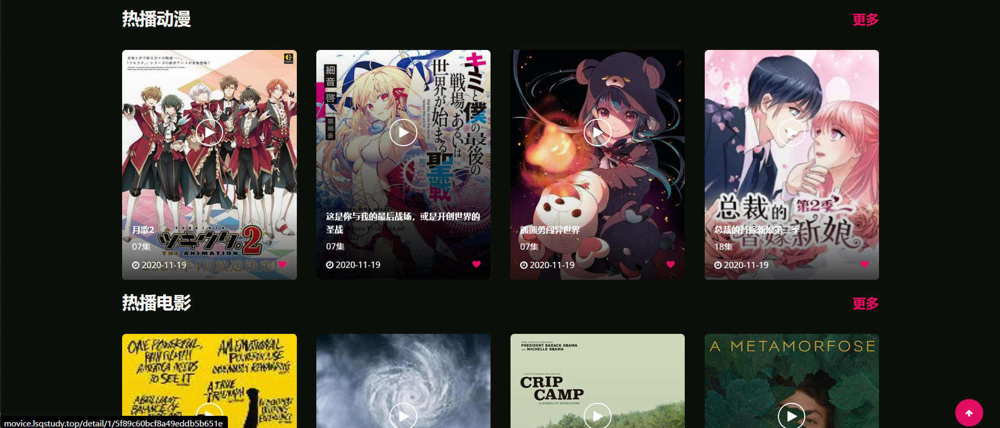

# 卖剩鸭视频网

项目已经部署到阿里云的云服务器ECS上

访问地址：http://movice.lsqstudy.top

## 描述

项目名称：卖剩鸭视频网

开发工具：IDEA2020.1 + MySQL5.7 + Maven3.5.4 + Git + JDK1.8

项目描述：门户系统提供电影、电视剧、动漫的在线播放与下载，后台管理系统对这些视频数据进行管理并对不同类型的管理员进行权限控制。

模块描述：

+ 门户模块
+ 后台管理模块

实现技术：

+ 使用 Maven 作为构建和依赖管理工具；
+ 使用 GitHub 进行代码托管；
+ 使用 SpringBoot 整合环境作为基础架构；
+ 使用 MySQL、MongoDB 数据库进行数据储存；
+ 使用 Spring Data JPA、Spring Data MongoDB 技术进行数据持久化操作；
+ 使用 Spring Data Redis 进行缓存开发；
+ 使用 FastDFS 存储上传的图片；
+ 使用 Shiro 完成后台管理系统的权限控制。
+ 使用 Thymeleaf 模板技术进行页面渲染；
+ 使用 Layui、JQuery 作为辅助开发。

## 图片演示

### 门户系统

### 后台管理系统

